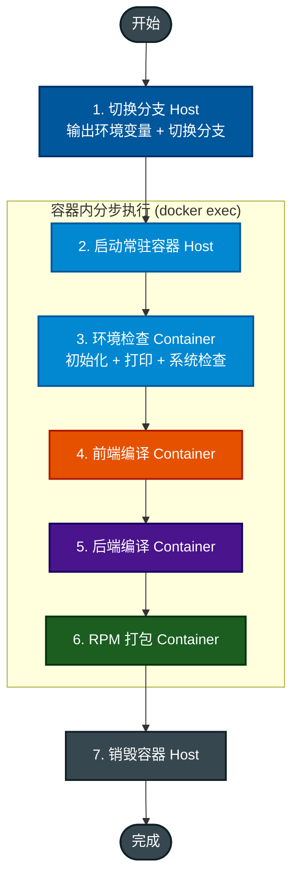

# ODC RPM 构建流水线梳理 (GoCD 分步执行)

本文档定义了 ODC RPM 包构建的模块化流程。在 GoCD 中，采用 **“启动常驻容器 -> 分步执行任务”** 的模式，以获得最佳的可视化和错误定位能力。

## 0. GoCD 任务配置指南 (Tasks)

建议在 GoCD 的 Job 中依次配置以下 Tasks：

| 步骤 | 任务名称 | 执行命令 (Shell Task) | 运行条件 | 执行位置 | 说明 |
| :--- | :--- | :--- | :--- | :--- | :--- |
| **1. Switch Branches** | 切换分支 | `./ci/script/switch_branches.sh` | 默认 | **Host** | 输出环境变量、切换前后端分支 |
| **2. Setup** | 启动构建容器 | `./ci/docker/manage_container.sh start` | 默认 | Host | 启动常驻容器 |
| **3. Init** | 环境检查 | `./ci/docker/manage_container.sh exec "./ci/script/env_check.sh"` | 默认 | Container | 初始化环境变量、打印环境变量、检查系统环境 |
| **4. Frontend** | 前端编译 | `./ci/docker/manage_container.sh exec "./ci/script/build_frontend.sh"` | 默认 | Container | 编译前端代码 |
| **5. Backend** | 后端编译 | `./ci/docker/manage_container.sh exec "./ci/script/build_backend.sh"` | 默认 | Container | 编译后端代码 |
| **6. Package** | RPM 打包 | `./ci/docker/manage_container.sh exec "./ci/script/build_rpm_pkg.sh"` | 默认 | Container | 打包 RPM 文件 |
| **7. Cleanup** | 销毁容器 | `./ci/docker/manage_container.sh stop` | **Always / Any** | Host | 清理容器资源 |

---

## 1. 架构设计与路径定义

采用容器化构建旨在解决 GoCD Agent 环境权限受限、依赖不一致的问题。

| 层次 | 职责 | 环境说明 |
| :--- | :--- | :--- |
| **Host (GoCD Agent)** | 源码同步、生命周期管理 | 无 `sudo` 权限，仅需安装 `docker` |
| **Container (Build Image)** | 编译前端、编译后端、RPM 打包 | 预装 JDK8, Maven (Aliyun), Node18, pnpm10 |

### 路径映射定义

| 定义项 | Host 路径 (GoCD Agent) | Container 路径 | 说明 |
| :--- | :--- | :--- | :--- |
| **工作目录** | `/var/lib/go-agent/pipelines/odc/` | `/root/odc` | 流水线根目录 |
| **代码目录** | `source_code/` | `/root/odc/source_code` | 挂载项目源码 |
| **最终产物** | `source_code/*.rpm` | `/root/odc/source_code/*.rpm` | 构建完成的 RPM 包 |

---

## 2. 整体流程概览



---

## 3. 容器镜像定义 (Docker Image)

镜像名称：`reg.actiontech.com/actiontech-dev/odc/build-env:1.0 `

| 类别 | 关键组件 | 优化说明 |
| :--- | :--- | :--- |
| **基础镜像** | Ubuntu 22.04 | 更好的兼容性与国内源支持 |
| **Java 环境** | OpenJDK 8 | 后端编译必需 |
| **Maven 环境** | Maven 3.6.3 | **配置 Aliyun 镜像源加速** |
| **Node.js 环境** | Node.js 18.20.0 | 满足 pnpm 10 运行要求 |
| **前端工具** | pnpm 10.28.1 | **配置 npmmirror 镜像源加速** |
| **系统工具** | `rpm`, `file`, `git`, `xz-utils` | 打包及工具链 |
| **构建命令** | `docker build -t ... -f ci/docker/Dockerfile .` | 详见下方说明 |

### 3.1 镜像维护指南

若需更新构建环境，请在项目根目录下执行：

```bash
# 1. 构建镜像 (按需修改 Tag)
docker build -t reg.actiontech.com/actiontech-dev/odc/build-env:1.0 -f ci/docker/Dockerfile .

# 2. 推送镜像
docker push reg.actiontech.com/actiontech-dev/odc/build-env:1.0
```

> **注意**：
> 1. 上述镜像是流水线的默认配置。
> 2. 若需在 GoCD 中临时切换镜像，请设置环境变量 `ODC_BUILD_IMAGE`。
> 3. 若只需修改部分参数，可单独设置 `ODC_REGISTRY` 或 `ODC_TAG`。
---

## 4. 关键脚本说明

### 4.1 分支切换 (`ci/script/switch_branches.sh`)
在主机上执行，负责：
- **环境变量输出**: 初始化环境变量默认值并打印关键环境变量
- **后端分支切换**: 切换到 `ODC_SERVER_BRANCH` 指定的分支（默认 `test/build_rpm`）
- **前端分支切换**: 通过子模块同步切换到 `ODC_UI_BRANCH` 指定的分支（默认 `dev-4.3.4-v2`）

### 4.2 生命周期管理 (`ci/docker/manage_container.sh`)
- **start**: 自动拉取远程镜像，启动常驻容器，并初始化 Git `safe.directory` 权限。
- **exec**: 在运行中的容器内执行指定命令，并实时流式输出日志。
- **stop**: 停止并销毁容器，确保 Agent 环境整洁。

### 4.3 环境检查 (`ci/script/env_check.sh`)
在容器内执行，负责：
- **环境变量初始化**: 为未设置的环境变量设置默认值
- **环境变量打印**: 以表格形式打印所有关键环境变量
- **系统环境检查**: 检查 OS、系统工具、Java、Maven、Node 等依赖

### 4.4 本地一键构建 (`ci/docker/run_build.sh`)
封装了从 Host 端分支切换到容器内全流程构建的逻辑，用于本地开发环境快速验证。

---

## 5. 关键环境变量 (Variables)

| 变量名 | 默认值 | 用途说明 |
| :--- | :--- | :--- |
| `RPM_RELEASE` | 当前日期 | RPM 包的 Release 号 |
| `BUILD_PROFILE` | - | Maven Profile (如 `oss`) |
| `FETCH_FROM_OSS` | `0` | 是否从 OSS 获取 `obclient.tar.gz` |
| `IS_IN_CONTAINER` | `1` | 标识当前运行在容器内 |
| `CI` | `true` | 开启工具链的非交互模式 |
