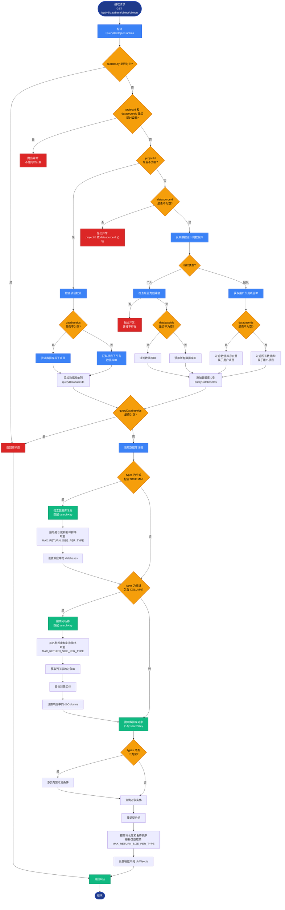

# listDatabaseObjects 接口流程图

```mermaid
flowchart TD
    Start([接收请求<br/>GET /api/v2/database/object/objects]) --> BuildParams[构建 QueryDBObjectParams]
    BuildParams --> CheckSearchKey{searchKey 是否为空?}
    CheckSearchKey -->|是| ReturnEmpty[返回空响应]
    CheckSearchKey -->|否| ValidateParams{projectId 和<br/>datasourceId 是否<br/>同时设置?}
    
    ValidateParams -->|是| ThrowError1[抛出异常:<br/>不能同时设置]
    ValidateParams -->|否| CheckProjectId{projectId<br/>是否不为空?}
    
    CheckProjectId -->|是| CheckProjectPermission[检查项目权限]
    CheckProjectPermission --> CheckDatabaseIds1{databaseIds<br/>是否不为空?}
    CheckDatabaseIds1 -->|是| ValidateDatabases[验证数据库属于项目]
    ValidateDatabases --> AddProjectDBIds[添加数据库ID到<br/>queryDatabaseIds]
    CheckDatabaseIds1 -->|否| GetProjectDBIds[获取项目下所有<br/>数据库ID]
    GetProjectDBIds --> AddProjectDBIds
    
    CheckProjectId -->|否| CheckDatasourceId{datasourceId<br/>是否不为空?}
    CheckDatasourceId -->|否| ThrowError2[抛出异常:<br/>projectId 或 datasourceId 必填]
    CheckDatasourceId -->|是| GetDatabasesByConnection[获取数据源下的数据库]
    GetDatabasesByConnection --> CheckOrgType{组织类型?}
    
    CheckOrgType -->|个人| CheckCreator[检查是否为创建者]
    CheckCreator -->|否| ThrowError3[抛出异常:<br/>连接不存在]
    CheckCreator -->|是| CheckDatabaseIds2{databaseIds<br/>是否不为空?}
    CheckDatabaseIds2 -->|是| FilterDBIds1[过滤数据库ID]
    CheckDatabaseIds2 -->|否| AddAllDBIds1[添加所有数据库ID]
    FilterDBIds1 --> AddDatasourceDBIds[添加数据库ID到<br/>queryDatabaseIds]
    AddAllDBIds1 --> AddDatasourceDBIds
    
    CheckOrgType -->|团队| GetProjectIds[获取用户所属项目ID]
    GetProjectIds --> CheckDatabaseIds3{databaseIds<br/>是否不为空?}
    CheckDatabaseIds3 -->|是| FilterDBIds2[过滤:数据库存在且<br/>属于用户项目]
    CheckDatabaseIds3 -->|否| FilterAllDBIds[过滤所有数据库:<br/>属于用户项目]
    FilterDBIds2 --> AddDatasourceDBIds
    FilterAllDBIds --> AddDatasourceDBIds
    
    AddProjectDBIds --> CheckEmpty{queryDatabaseIds<br/>是否为空?}
    AddDatasourceDBIds --> CheckEmpty
    CheckEmpty -->|是| ReturnEmpty
    CheckEmpty -->|否| GetDatabaseDetails[获取数据库详情]
    
    GetDatabaseDetails --> CheckTypes1{types 为空或<br/>包含 SCHEMA?}
    CheckTypes1 -->|是| SearchSchemas[搜索数据库名称<br/>匹配 searchKey]
    SearchSchemas --> SortSchemas[按名称长度和名称排序<br/>取前 MAX_RETURN_SIZE_PER_TYPE]
    SortSchemas --> SetDatabases[设置响应中的 databases]
    CheckTypes1 -->|否| CheckTypes2{types 为空或<br/>包含 COLUMN?}
    SetDatabases --> CheckTypes2
    
    CheckTypes2 -->|是| SearchColumns[搜索列名称<br/>匹配 searchKey]
    SearchColumns --> SortColumns[按名称长度和名称排序<br/>取前 MAX_RETURN_SIZE_PER_TYPE]
    SortColumns --> GetObjectIds[获取列关联的对象ID]
    GetObjectIds --> GetObjects[查询对象实体]
    GetObjects --> SetColumns[设置响应中的 dbColumns]
    CheckTypes2 -->|否| SearchDBObjects
    
    SetColumns --> SearchDBObjects[搜索数据库对象<br/>匹配 searchKey]
    SearchDBObjects --> FilterByTypes{types 是否<br/>不为空?}
    FilterByTypes -->|是| AddTypeFilter[添加类型过滤条件]
    FilterByTypes -->|否| QueryObjects[查询对象实体]
    AddTypeFilter --> QueryObjects
    
    QueryObjects --> GroupByType[按类型分组]
    GroupByType --> SortObjects[按名称长度和名称排序<br/>每种类型取前 MAX_RETURN_SIZE_PER_TYPE]
    SortObjects --> SetDBObjects[设置响应中的 dbObjects]
    SetDBObjects --> ReturnResponse[返回响应]
    ReturnEmpty --> ReturnResponse
    ReturnResponse --> End([结束])

    style Start fill:#1e3a8a,stroke:#1e40af,stroke-width:3px,color:#ffffff
    style End fill:#1e3a8a,stroke:#1e40af,stroke-width:3px,color:#ffffff
    style ReturnEmpty fill:#dc2626,stroke:#b91c1c,stroke-width:2px,color:#ffffff
    style ThrowError1 fill:#dc2626,stroke:#b91c1c,stroke-width:2px,color:#ffffff
    style ThrowError2 fill:#dc2626,stroke:#b91c1c,stroke-width:2px,color:#ffffff
    style ThrowError3 fill:#dc2626,stroke:#b91c1c,stroke-width:2px,color:#ffffff
    style CheckSearchKey fill:#f59e0b,stroke:#d97706,stroke-width:2px,color:#000000
    style ValidateParams fill:#f59e0b,stroke:#d97706,stroke-width:2px,color:#000000
    style CheckProjectId fill:#f59e0b,stroke:#d97706,stroke-width:2px,color:#000000
    style CheckDatasourceId fill:#f59e0b,stroke:#d97706,stroke-width:2px,color:#000000
    style CheckDatabaseIds1 fill:#f59e0b,stroke:#d97706,stroke-width:2px,color:#000000
    style CheckDatabaseIds2 fill:#f59e0b,stroke:#d97706,stroke-width:2px,color:#000000
    style CheckDatabaseIds3 fill:#f59e0b,stroke:#d97706,stroke-width:2px,color:#000000
    style CheckOrgType fill:#f59e0b,stroke:#d97706,stroke-width:2px,color:#000000
    style CheckEmpty fill:#f59e0b,stroke:#d97706,stroke-width:2px,color:#000000
    style CheckTypes1 fill:#f59e0b,stroke:#d97706,stroke-width:2px,color:#000000
    style CheckTypes2 fill:#f59e0b,stroke:#d97706,stroke-width:2px,color:#000000
    style FilterByTypes fill:#f59e0b,stroke:#d97706,stroke-width:2px,color:#000000
    style BuildParams fill:#3b82f6,stroke:#2563eb,stroke-width:2px,color:#ffffff
    style CheckProjectPermission fill:#3b82f6,stroke:#2563eb,stroke-width:2px,color:#ffffff
    style ValidateDatabases fill:#3b82f6,stroke:#2563eb,stroke-width:2px,color:#ffffff
    style GetProjectDBIds fill:#3b82f6,stroke:#2563eb,stroke-width:2px,color:#ffffff
    style GetDatabasesByConnection fill:#3b82f6,stroke:#2563eb,stroke-width:2px,color:#ffffff
    style CheckCreator fill:#3b82f6,stroke:#2563eb,stroke-width:2px,color:#ffffff
    style GetProjectIds fill:#3b82f6,stroke:#2563eb,stroke-width:2px,color:#ffffff
    style GetDatabaseDetails fill:#3b82f6,stroke:#2563eb,stroke-width:2px,color:#ffffff
    style SearchSchemas fill:#10b981,stroke:#059669,stroke-width:2px,color:#ffffff
    style SearchColumns fill:#10b981,stroke:#059669,stroke-width:2px,color:#ffffff
    style SearchDBObjects fill:#10b981,stroke:#059669,stroke-width:2px,color:#ffffff
    style ReturnResponse fill:#10b981,stroke:#059669,stroke-width:2px,color:#ffffff
```
