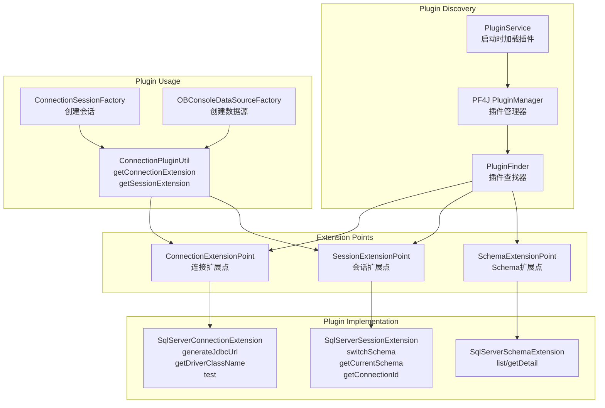

# 数据源插件扩展架构

## 扩展方法

1. **实现 ConnectionExtensionPoint**
   - generateJdbcUrl: 生成 JDBC URL
   - getDriverClassName: 返回驱动类名
   - test: 测试连接
   - getConnectionInitializers: 连接初始化器

2. **实现 SessionExtensionPoint**
   - switchSchema: 切换Schema
   - getCurrentSchema: 获取当前Schema
   - getConnectionId: 获取连接ID
   - getVariable: 获取变量值

3. **注册插件**
   - 使用 @Extension 注解
   - 在 plugin.properties 中声明 DialectType
   - 插件JAR放入 distribution/plugins 目录
