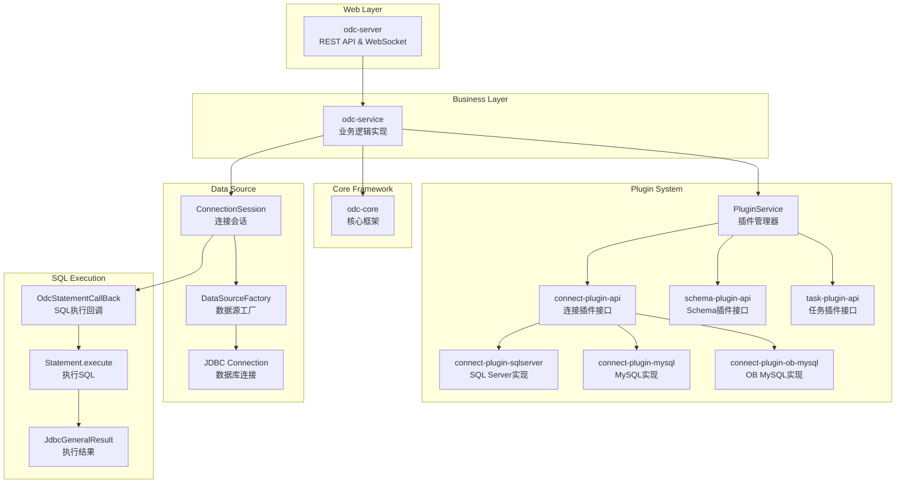

# ODC Server 整体架构

```mermaid
graph TB
    subgraph "Web Layer"
        A[odc-server<br/>REST API & WebSocket]
    end
    
    subgraph "Business Layer"
        B[odc-service<br/>业务逻辑实现]
    end
    
    subgraph "Core Framework"
        C[odc-core<br/>核心框架]
    end
    
    subgraph "Plugin System"
        D[PluginService<br/>插件管理器]
        E[connect-plugin-api<br/>连接插件接口]
        F[schema-plugin-api<br/>Schema插件接口]
        G[task-plugin-api<br/>任务插件接口]
        H[connect-plugin-sqlserver<br/>SQL Server实现]
        I[connect-plugin-mysql<br/>MySQL实现]
        J[connect-plugin-ob-mysql<br/>OB MySQL实现]
    end
    
    subgraph "Data Source"
        K[ConnectionSession<br/>连接会话]
        L[DataSourceFactory<br/>数据源工厂]
        M[JDBC Connection<br/>数据库连接]
    end
    
    subgraph "SQL Execution"
        N[OdcStatementCallBack<br/>SQL执行回调]
        O[Statement.execute<br/>执行SQL]
        P[JdbcGeneralResult<br/>执行结果]
    end
    
    A --> B
    B --> C
    B --> D
    D --> E
    D --> F
    D --> G
    E --> H
    E --> I
    E --> J
    B --> K
    K --> L
    L --> M
    K --> N
    N --> O
    O --> P
```
